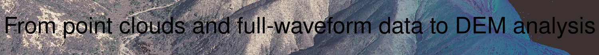

# 
From point clouds and full-waveform data to DEM analysis (Sep-30 to Oct-4 2019) 

#### 
Point-cloud workshop at the University of Potsdam

Support from
- [StRATEGy](http://www.irtg-strategy.de/index/) graduate school
- [University of Potsdam](https://up-rs-esp.github.io/)
- the [US-National Science Foundation EarthCube RCN "Connecting the Earth Science and Cyberinfrastructure communities to advance the analysis of high resolution topography data"](https://www.nsf.gov/awardsearch/showAward?AWD_ID=1642611&HistoricalAwards=false)
- [OpenTopography](https://opentopography.org/)

## Description
In the past few years, the density and quality of point cloud data from lidar and photogrammetry has massively increased. This has enabled important new understanding in earth surface process science, but also has challenged our analytical tools and computational workflows. The generation of high resolution Digital Elevation Models, flow routing on point clouds, and surface roughness estimation has become more accessible and provides important measures of topography at the fine scale at which the processes operate.  This workshop presents approaches to analyzing point cloud data and producing useful derived products. It also explores future applications in earth surface processes.

The workshop will progress from point cloud analysis to appropriate filtering and gridding and then geomorphic analysis on grids and point clouds. In addition, we will spend one day on explorations of full waveform analyses for a variety of applications as these data are progressively becoming more available and useful for bathymetric, vegetation, surface roughness measurements, and material property mapping.

This course is intended for graduate students and researchers with interests in surface processes and with experience in programming (Python and Matlab).

## Organization Committee and Instructors
[Bodo Bookhagen](https://bodobookhagen.github.io/), [Wolfgang Schwanghart](https://topotoolbox.wordpress.com/), [Fiona Clubb](https://fclubb.github.io/), [Aljoscha Rheinwalt](https://github.com/Rheinwalt), [Ramon Arrowsmith](https://www.public.asu.edu/~arrows/), [Chris Crosby](https://connect.unavco.org/display/per508132)

## Participation will be by application (we are limited to 20 participants)
We expect to have an application page up soon and the deadline to apply will be August 16, 2019. There is no fee for the workshop.

# Tentative Program
**Monday, Sept 30, 2019**
- OpenTopography introduction and production implementations
  - Point cloud selection and review of basic processiing workflows
  - DEM processing using neighborhood and triangulation methods to produce DSM and DTMs
  - DEM processing for flow routing using TauDEM HPC

- Desktop based (Python driven) computational workflows (I)
  - point cloud classification and filtering
  - interpolation to grids using the most appropriate methods (from triangulation to IDW and fitting green's functions and splines and other surfaces)
  - Airborne lidar to photogrammetric SFM warping example

*Evening student presentations*

**Tuesday, October 1, 2019**
- Desktop based (Python driven) computational workflows (II)
  - Flow routing on point clouds using TINs
  - Channel Head identification using point clouds with various densities
  - Other topics depending on time and participant's interests

*Evening student presentations*

**Wednesday, October 2, 2019**
- Topographic metrics and processing with [Matlab TopoToolbox](https://topotoolbox.wordpress.com/)
  - Introduction
  - basic operations, data types, and structures
  - Steepness indices

**Thursday, October 3, 2019**
- Full waveform lidar explanation and exploration with specific applications for geomorphology
   - micro-surface roughness
   - better characterization of ground (and other) surfaces
   - material-surface characteristics
   - water-column characteristics
   - biomass estimation

**Friday, October 4, 2019**
- Topographic analysis with [LSD TopoTools](https://lsdtopotools.github.io/)
  - Introduction
  - River-profile clustering
  - Ridge-top curvature
  - Making appealing maps with GMT

***Evening student*** **presentations**
We will have short presentations by participants on Monday and Tuesday early evenings. You are STRONGLY encouraged to make one of these short (<5 minutes/<5 slides) presentations. We will have a computer and projector there and will collect the presentations in advance for quick transitions. Given the big group, we will be strict on timing, but we do look forward to hearing about your work, your ideas, or even questions. This will be very informal!
