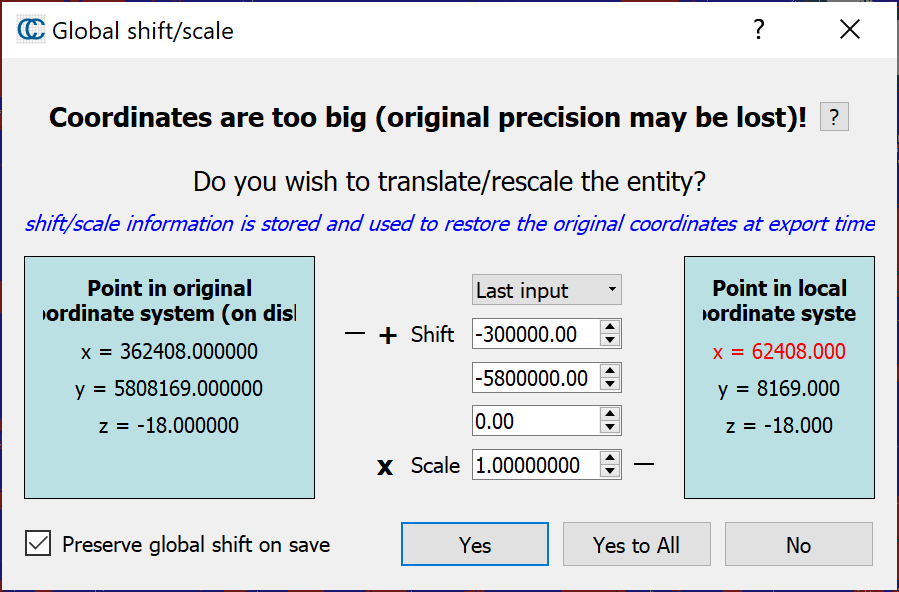
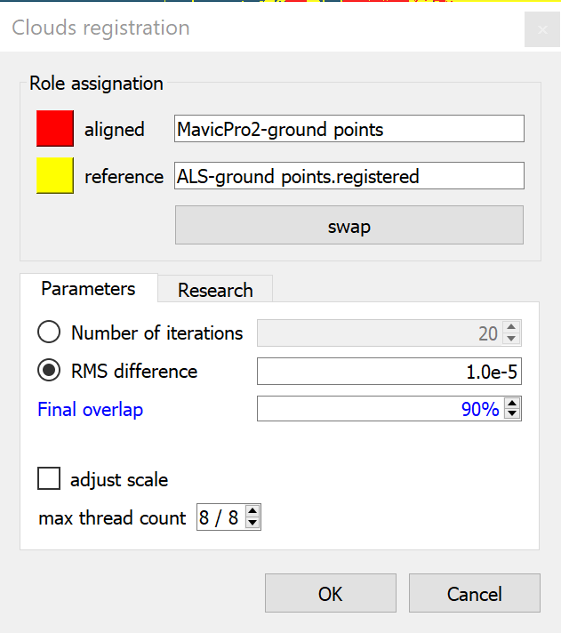
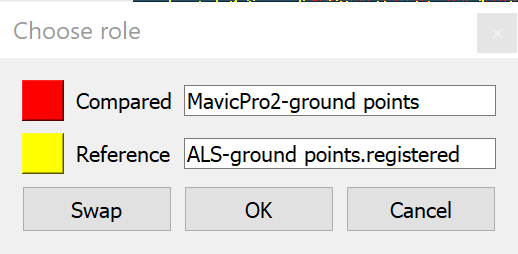
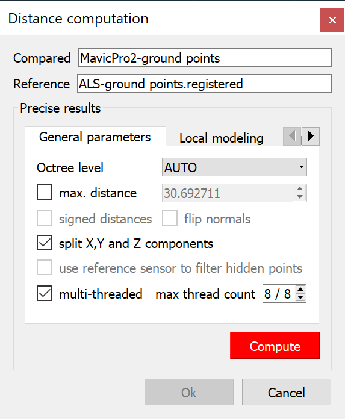
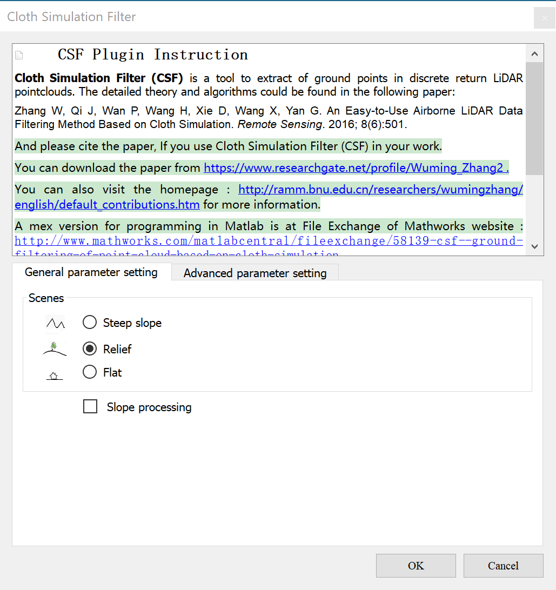
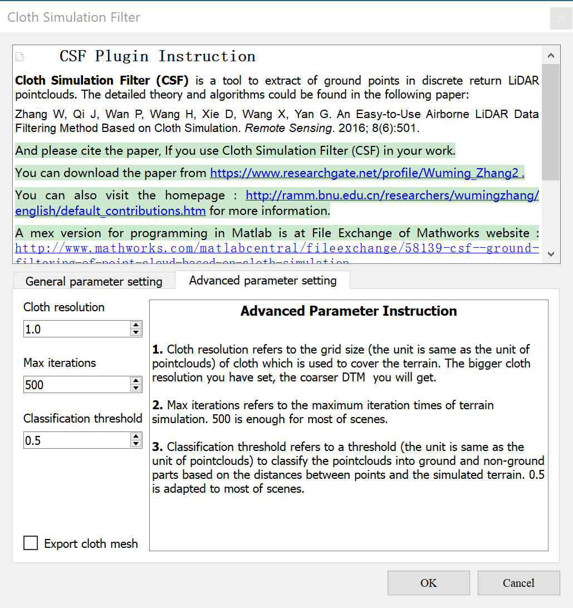
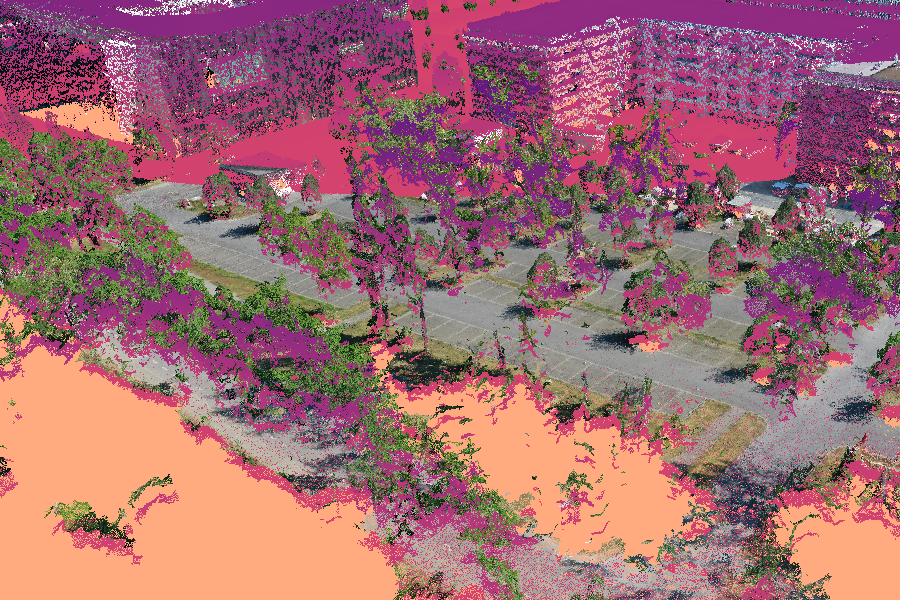

---
title: "Aligning ALS (Milan, May-06-2018) and UAV (Mavic Pro 2, Aug 2019) data using a spherical fit"
author: B. Bookhagen and A. Rheinwalt
date: 30-09-2019
header-includes: |
    \usepackage{caption}
...

We will use a precise airborne lidar dataset (ALS) with a high point density as reference dataset. We will align a UAV (Mavic Pro 2, nadir and 15-degree oblique imagery, processing with Agisoft Metashape/PhotoScan). You will note a doming effect of the UAV dataset - we will explore these further by fitting a sphere.

Alignment and Visualization is done in CloudCompare (can be done in `PDAL` or `python` as well)

Pointclouds used and generated in this exercise:

|Name|Link|Description|
|:----|:----|:----|
ALS_Golm_May06_ 2018_Milan_ UTM33N_WGS84_6digit_ cl_clip.laz | [LAZ](https://www.dropbox.com/s/ocfj1kpfsap63pz/ALS_Golm_May06_2018_Milan_UTM33N_WGS84_6digit_cl_clip.laz?dl=0) | Airborne Lidar Pointcloud, collected May-06-2018 (UTM33N-WGS84). Clipped to the University of Potsdam Campus in Golm.
UAV_mavicpro2_ nadir_15deg_ highq_dense_PC_ 10cm.laz | [LAZ](https://www.dropbox.com/s/lyujyp3etela37z/UAV_mavicpro2_nadir_15deg_highq_dense_PC_10cm.laz?dl=0) | UAV Mavic Pro 2 flight from August 2019, nadir and 15-degree oblique images processed with Metashape Photoscan and interpolated to 10 cm pixel spacing (UTM33N-WGS84). This is an output directly from Metashape.
UAV_mavicpro2_ nadir_15deg_ highq_dense_PC_ 10cm_cl2.laz | [LAZ](https://www.dropbox.com/s/km63pilkcqo6ryz/UAV_mavicpro2_nadir_15deg_highq_dense_PC_10cm_cl2.laz?dl=0) | Ground-classified PC (generated in *step 1* below)
UAV_mavicpro2_ nadir_15deg_ highq_dense_PC_ 10cm_c2cdist.laz | [LAZ](https://www.dropbox.com/s/5mo15ftqglfsvyc/UAV_mavicpro2_nadir_15deg_highq_dense_PC_10cm_c2cdist.laz?dl=0) | Ground-classified UAV PC aligned to ALS and containing cloud-to-cloud distances (generated in *steps 1 to 5* below). This is, in case your alignment and cloud-to-cloud distance calculation did not succeed


# Pointcloud (Pre-)Processing in CloudCompare

1. *Classify the UAV point cloud into ground and non-ground points*. The classification of the point cloud into ground and non-ground points will help to perform the fitting procedure in python (because we prefer to determine the height offsets from ground points only. Here, we use a simple ground-detection algorithm using a Simple Morphological Filter (SMRF) implemented in [pdal's SMRF](https://pdal.io/stages/filters.smrf.html). Let's assume you have stored the PC `UAV_mavicpro2_nadir_15deg_highq_dense_PC_10cm.laz` and there are no parameters changed for the SMRF classification (i.e. using standard parameters):
  ```
  pdal translate UAV_mavicpro2_nadir_15deg_highq_dense_PC_10cm.laz -o UAV_mavicpro2_nadir_15deg_highq_dense_PC_10cm_cl2.laz smrf
  ```
  **Note that this will take up to a minute/few minutes to run at 38 Mio points.**

2. *Load in data*. First load in ALS (reference PC) first. THEN load in second point cloud (Mavic Pro 2), make sure you use the same reference frame (last input and not suggested).


\begin{figure}[!h]
\caption{Make sure to select 'last input' when loading the second point cloud.}
\end{figure}
\hfill

3. *ICP Alignment*: Select two point clouds to be aligned, then select Tools->Registration->Fine Registration (ICP).
  - Set overlap to 90% (or something similar) before running the ICP step (unless you can be certain that the extent is exactly the same). No need for changing parameters on the research tab.
  - Make sure to store resulting transformation matrix (select in console and copy) - it will be useful to save this.
  - Verify that point clouds are aligned.

{width=50%}
{width=50%}
\begin{figure}[!h]
\caption{ICP Alignment}
\end{figure}
\hfill

The Transformation matrix used to translate and rotate the UAV PC to the ALS PC:
```
0.999994635582 -0.001396339852 -0.002982418053 10.368410110474
0.001394736348 0.999999046326 -0.000539620640 -85.716972351074
0.002983167768 0.000535457977 0.999995350838 -126.917495727539
0.000000000000 0.000000000000 0.000000000000 1.000000000000
```

4. *Calculate Cloud-to-Cloud Distance*: Select two point clouds, Tools->Distances->Cloud/Cloud Distance. Make sure to split into X, Y, Z direction

{width=50%}
{width=50%}
\begin{figure}[!h]
\caption{Cloud2Cloud Distance Computation Parameters}
\end{figure}
\hfill

5. Save UAV points, make sure to save additional fields. This will store a UAV (Mavic Pro 2) LAZ file with X, Y, Z fields, and c2c distances. *Note: Some OS/installations have problems reading LAZ files, it may be useful to store as LAS file (without compression), if you have trouble.*

**UAV_mavicpro2_nadir_15deg_highq_dense_PC_10cm_c2cdist.laz: We have no generated a PC dataset that is aligned to the ALS data, contains the Z-distance in meters (cloud-to-cloud) distance and has classified ground and non-ground points.**


6. *Alternative to step 1: Ground-Point Cloud Classification in CloudCompare* : Using Plugin Cloth Simulation Filter (CSF) and perform Cloth Simulation Filter Classification with resolution r=1 using Plugins->CSF Filter (Will not work well for UAV datasets).
  - Are there problems with the classification? Is bare earth/ground properly detected?

{width=50%}
{width=50%}
\begin{figure}[!h]
\caption{Cloth Simulation Filter (CSF) Classification}
\end{figure}
\hfill


## Systematic doming error in Structure-from-Motion (SfM) derived topographic data

Topographic data such as point clouds derived from vertical imagery often show
large scale deformations that are due to radial lens distortions. Small errors
in the calibration of the camera model propagate into elevation estimates,
leading to a systematic error often expressed as a central *doming* (e.g. Rosnell
and Honkavaara, 2012; Javernick et al., 2014; James and Robson, 2014).



We quantify this systematic doming error by the z-component of distance
vectors between SfM points and corresponding closest points in a geo-referenced
lidar point cloud. CloudCompare can compute these cloud-to-cloud distances and
can store them inside LAS files.

Reading such a LAS file in Python using the module **laspy**:

~~~~~~~~~~~~~~~~~ {.python .numberLines}
fname = 'UAV_mavicpro2_nadir_15deg_highq_dense_PC_10cm_c2cdist.laz'
print('reading', fname)
f = laspy.file.File(fname)
x = f.x
y = f.y
z = f.z
classification = f.classification
dz = getattr(f,'c2c_absolute_distances_(z)').copy()
f.close()
~~~~~~~~~~~~~~~~~

Vertical distances **dz** can get quite large at steep surfaces such as from buildings,
but also due to changes in vegetation and constructions. Therefore, we
limit the point cloud only to ground classified points with moderate **dz** (-2, 2):

~~~~~~~~~~~~~~~~~ {.python .numberLines}
print('c2c absolute distances (z):')
print('pre min, mean, max:', dz.min(), dz.mean(), dz.max())
j = (-2 <= dz) * (dz <= 2)
xj, yj, dzj = x[j], y[j], dz[j]
dzj *= 10
print('post min, mean, max:', dzj.min(), dzj.mean(), dzj.max())

print('extract ground class ..')
pts = np.transpose((xj, yj, dzj))
pts = pts[classification[j] == 2]
~~~~~~~~~~~~~~~~~

As the error model for the systematic doming error we choose a sphere. A least
squares fit to a 3D sphere can be done in the following way:

~~~~~~~~~~~~~~~~~ {.python .numberLines}
def fitsphere(pts):
    # CuPy should be faster for large point clouds
    # i.e., pts.shape[0] > 1e5
    from scipy.linalg import lstsq

    A = np.zeros((pts.shape[0], 4))
    x, y, z = pts[:,0], pts[:,1], pts[:,2]
    A[:,0] = x * 2
    A[:,1] = y * 2
    A[:,2] = z * 2
    A[:,3] = 1
    f = np.zeros((len(x), 1))
    f[:,0] = x*x + y*y + z*z
    c, resid, rank, sval = lstsq(A, f)
    r = np.sqrt(c[0]*c[0] + c[1]*c[1] + c[2]*c[2] + c[3])

    # return radius and center of sphere
    return (r, c[0], c[1], c[2])
~~~~~~~~~~~~~~~~~

Applied to the point cloud:

~~~~~~~~~~~~~~~~~ {.python .numberLines}
print('fit spherical error model to ground component ..')
ptsmin = pts.min(axis = 0)
R, x0, y0, z0 = fitsphere(pts-ptsmin)
x0 += ptsmin[0]
y0 += ptsmin[1]
z0 += ptsmin[2]

# transform (x, y, z) -> (x, y, z-zsphere)
zsphere = z0 - np.sqrt(R*R - (x-x0)**2-(y-y0)**2)
zsphere /= 10

# corrected point cloud cpts
cpts = np.transpose((x, y, z-zsphere))

print('export corrected point cloud to LAZ file ..')
exportlas('%s_spherical_corrected.laz' % fname[:-4], cpts[:,2], cpts)
~~~~~~~~~~~~~~~~~

The residuals **r** are given by **r = dz - zsphere** and if the error
model is correct these should be small and flat in space. We test the
flatness with a least squares plane fit on the residuals:

~~~~~~~~~~~~~~~~~ {.python .numberLines}
A = np.transpose((x, y, np.ones(x.shape)))
c, resid, rank, sval = lstsq(A, dz - zsphere)
print(c)

# z of the residual plane
zrp = c[0]*x + c[1]*y + c[2]
~~~~~~~~~~~~~~~~~

Exporting to LAS files can be done with the following function:

~~~~~~~~~~~~~~~~~ {.python .numberLines}
def exportlas(fname, var, pnts, cmap = None, classification = None):
    import laspy
    import os
    from subprocess import call

    if cmap is None:
        from matplotlib.cm import magma_r
        cmap = magma_r

    fn, fe = os.path.splitext(fname)

    # var -> v: [0,1]
    v = var - np.min(var)
    v /= v.max()

    # RGB colors
    rgb = cmap(v)
    rgb = rgb[:, :3]
    rgb *= 65535
    rgb = rgb.astype('uint')

    # LAS file
    header = laspy.header.Header()
    header.data_format_id = 2
    f = laspy.file.File('%s.las' % fn, mode = 'w', header = header)
    f.header.scale = [0.001, 0.001, 0.001]
    f.header.offset = [pnts[:,0].min(), pnts[:,1].min(), pnts[:,2].min()]
    f.x = pnts[:, 0]
    f.y = pnts[:, 1]
    f.z = pnts[:, 2]
    if classification is not None:
        f.classification = classification
    f.set_red(rgb[:, 0])
    f.set_green(rgb[:, 1])
    f.set_blue(rgb[:, 2])
    f.close()

    # try laszip
    try:
        r = call(['laszip', '%s.las' % fn])
        if not r:
            r = call(['rm', '%s.las' % fn])
    except:
        pass

~~~~~~~~~~~~~~~~~
